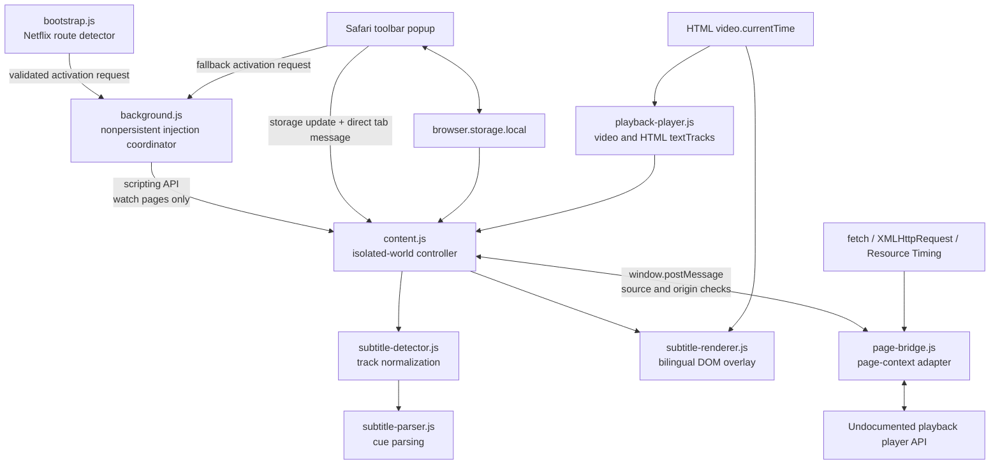

# Dual Subtitle Companion — Technical Documentation

This document describes the current macOS-only source tree. It distinguishes implemented behavior from manual runtime validation, incomplete tooling, and possible future work.

## 1. System overview

Dual Subtitle Companion is a macOS Safari Web Extension proof of concept. Its core objective is to obtain two official timed-text tracks already made available to the user's playback page—English and Traditional Chinese—and render them together without translating, downloading, or modifying video or audio.

The system has four execution contexts:

1. A native macOS containing app that reports extension status and opens Safari Settings or allowlisted support links.
2. A nonpersistent Manifest V3 background service worker and toolbar popup that coordinate validated playback-page injection and user state.
3. Safari Web Extension code in the isolated content-script world, including a lightweight Netflix route bootstrap, subtitle normalization, parsing, state coordination, and DOM overlay.
4. An injected page-context bridge that can reach the playback page's JavaScript player object and observe page-initiated network responses.

The page bridge exists because Safari content scripts are isolated from page JavaScript objects. Communication across that boundary uses `window.postMessage`; the browser extension APIs remain in the isolated world.

The implementation is deliberately narrow:

- macOS Safari only.
- A lightweight route bootstrap on `https://www.netflix.com/*`; player and subtitle modules only on `https://www.netflix.com/watch/*`.
- No injection or website access on non-Netflix domains.
- English and Traditional Chinese only.
- In-memory timed-text processing only.
- No DRM or MSL decryption.
- No subtitle download, export, or translation.

## 2. Architecture



### Execution boundaries

- `popup.js` and the content scripts use Safari Web Extension APIs exposed through the `browser` namespace.
- `bootstrap.js` runs only on `www.netflix.com`, observes URL changes without reading player or subtitle data, and requests activation only for exact HTTPS `/watch/*` routes.
- `background.js` is a nonpersistent Manifest V3 service worker. It re-reads the target tab URL, requires the exact `www.netflix.com` hostname and `/watch/` path, checks whether `content.js` is already ready, and serializes per-tab injection.
- `content.js`, the detector, parser, renderer, and player probe run in Safari's isolated content-script world.
- `page-bridge.js` is declared as a web-accessible resource and injected into the page context.
- The bridge wraps the page's `fetch` and `XMLHttpRequest` functions, reads Performance Resource Timing entries, and queries the page player object.
- Only plain serializable objects cross the `window.postMessage` boundary.

There is no options page, debug panel, database, backend, or cloud service. The background worker performs injection coordination only and stores no subtitle or account data.

## 3. Project structure

```text
Dual Subtitle Companion.xcodeproj/
  project.pbxproj                         Two macOS targets and their build settings

Shared (App)/
  ViewController.swift                    Native host controller and URL allowlist
  Resources/Base.lproj/Main.html          Setup, status, help, privacy, and support UI
  Resources/Script.js                     WKWebView-to-native actions and status UI
  Resources/Style.css                     Containing-app presentation
  Assets.xcassets/                        macOS app icons and accent color

macOS (App)/
  AppDelegate.swift                       App lifecycle; quits after last window closes
  Base.lproj/Main.storyboard              Native window and WKWebView layout

Shared (Extension)/
  SafariWebExtensionHandler.swift         Minimal NSExtension request completion
  Resources/
    manifest.json                         Manifest V3 scope and resource declaration
    bootstrap.js                          Netflix-only single-page route detector
    background.js                         Nonpersistent validated injection coordinator
    popup.html / popup.js / popup.css     Toolbar enable/disable UI
    content.js                            Top-level state and message coordinator
    page-bridge.js                        Player compatibility and response observation
    playback-player.js                    Video and HTML text-track polling
    subtitle-detector.js                  Track discovery, merging, and language matching
    subtitle-parser.js                    Cue parsing and time normalization
    subtitle-renderer.js                  Playback-synchronized overlay
    content.css                           Subtitle layout and colors
    _locales/en/messages.json             Extension name and description
    images/                               Toolbar and extension icons

macOS (Extension)/Info.plist              Safari Web Extension entry point
scripts/
  ExportOptions-DeveloperID.plist         Developer ID export settings
  build-notarized-dmg.sh                  App and DMG signing/notarization workflow

README.md                                 Developer and user entry point
PRIVACY_POLICY.md                         Local data-processing policy
THIRD_PARTY_NOTICES.md                    Trademark, service, and content disclaimer
LICENSE                                   MIT License for original project work
```

The current Xcode project contains exactly two targets:

- `Dual Subtitle Companion (macOS)`
- `Dual Subtitle Companion Extension (macOS)`

The host target embeds the extension target. The only shared scheme is `Dual Subtitle Companion (macOS)`.

## 4. Data flow

### 4.1 Startup and discovery

1. Safari injects only `bootstrap.js` at `document_start` on `https://www.netflix.com/*`.
2. On an exact HTTPS `/watch/*` route, the bootstrap asks the background worker to ensure the playback scripts are present. This catches Netflix single-page navigation that does not create a new document.
3. The background worker validates the live tab URL, checks `content.js` readiness, and injects the configured CSS and JavaScript files only when they are absent. Safari may also inject the same declared files directly when a document initially loads at `/watch/*`.
4. `content.js` rejects subframes and duplicate injection.
5. `content.js` injects `page-bridge.js` into the page context.
6. `playback-player.js` polls once per second for `document.querySelector("video")` and snapshots `video.textTracks`.
7. `page-bridge.js` probes the page player every five seconds and reports serializable timed-text metadata.
8. Performance Resource Timing, `fetch`, and `XMLHttpRequest` observations provide candidate resource URLs and response bodies.
9. `subtitle-detector.js` merges these observations into normalized track records.

### 4.2 Enabling bilingual subtitles

1. The toolbar writes `dualSubtitlesEnabled=true` and a timestamp-like `dualSubtitlesRevision` to extension local storage.
2. The toolbar also sends `set-dual-subtitles-enabled` directly to the active tab for immediate application.
3. If the playback content script is absent, the toolbar asks the background worker to perform the same validated injection used by the automatic route bootstrap, then retries the message automatically.
4. When the popup opens with a persisted enabled value after a Safari restart, it automatically repeats the active-tab synchronization. A popup-local revision guard prevents that asynchronous recovery from overwriting a newer user toggle.
5. `content.js` rejects state updates older than its current revision.
6. When the bridge is active and both language tracks have been identified, `content.js` requests a controlled probe.
7. The bridge saves the current native subtitle track, selects English, and waits for a parsed candidate.
8. It selects Traditional Chinese and again waits for a parsed candidate.
9. The bridge restores the original track after the probe.
10. If either cue collection is still missing, `content.js` retries the controlled probe up to three total attempts with a two-second delay.
11. Once both cue collections exist and restoration has completed, the bridge selects the site's None subtitle track.
12. The renderer displays the two custom subtitle lines using `video.currentTime`.

The direct popup response is not returned until native subtitle suspension succeeds, fails, or reaches the 45-second content-side timeout.

### 4.3 Disabling bilingual subtitles

1. The toolbar stores the disabled state and sends it directly to the active tab.
2. The renderer hides immediately.
3. The page bridge serializes a restoration operation through its `nativeOperation` promise chain.
4. The bridge tries the saved track ID, then the saved track object.
5. If neither is available in the current session, it falls back to Traditional Chinese and then English.
6. The popup receives a restored or failed result from `content.js`.

### 4.4 Cue rendering

1. Parsed cues are normalized and sorted by start time.
2. Each animation frame reads `video.currentTime`.
3. A binary search finds the insertion point for the current time.
4. A bounded backward scan collects overlapping active cues.
5. DOM text is changed only when the rendered text differs from the previous frame.
6. The overlay is hidden when bilingual mode is disabled or neither language has an active cue.

## 5. Core components

### Native containing app

`ViewController.swift` loads a local HTML page in `WKWebView`. It uses:

- `SFSafariExtensionManager.getStateOfSafariExtension` to read extension status.
- `SFSafariApplication.showPreferencesForExtension` to open Safari Settings.
- A fixed allowlist for the Privacy Policy, GitHub Issues, and Third-Party Notices.
- `NSWorkspace.shared.open` for approved external links.
- `showError(...)` in the local page for user-visible native failures.

`SafariWebExtensionHandler.swift` is intentionally minimal and only completes incoming extension requests. No application logic currently depends on native extension messages.

### Toolbar popup

`popup.js` owns the user-facing enable/disable control. It:

- Loads the stored Boolean state.
- Writes the Boolean and a new revision.
- Reads storage back to verify the write.
- Sends a direct message to the active tab.
- Shows success, fallback, timeout, or failure text.

### Isolated-world controller

`content.js` coordinates the extension modules. It owns the authoritative content-side state, injects the bridge, routes messages, associates candidates with controlled captures, and manages popup response waiters.

### Page compatibility bridge

`page-bridge.js` is the only module that reaches the undocumented player object. Its primary adapter path is:

```text
window.netflix
  .appContext
  .state
  .playerApp
  .getAPI()
  .videoPlayer
```

It discovers the first available player session, tries a small set of timed-text getter and setter names, and serializes only primitive track metadata back to the isolated world.

### Detector and parser

`subtitle-detector.js` combines metadata and cues from multiple sources. `subtitle-parser.js` converts supported formats to a shared cue model. Neither module persists results.

### Renderer

`subtitle-renderer.js` creates one fixed DOM root with English and Traditional Chinese children. `content.css` applies:

```css
font-size: clamp(20px, 2.35vw, 36px);
font-weight: 600;
```

English is white; Traditional Chinese is warm yellow. The overlay has `pointer-events: none` and a high `z-index`.

## 6. Data models and state management

The JavaScript uses plain objects rather than declared classes or TypeScript types.

### Normalized track

```js
{
  id: String | Number | null,
  trackId: String | Number | null,
  language: String,
  label: String,
  trackType: String | null,
  rawTrackType: String | null,
  isForcedNarrative: Boolean,
  isImageBased: Boolean,
  url: String | null,
  format: String,
  cues: Array<Cue>
}
```

The detector stores tracks in a `Map`. Its merge key prefers `trackId`, then `id`, then a composite of language, label, type, and URL. Existing cues are retained when a metadata-only update arrives.

### Cue

```js
{
  start: Number, // seconds
  end: Number,   // seconds
  text: String
}
```

Invalid numeric times, negative ordering, and empty text are filtered out. HTML-like cue text is reduced to plain text, with `<br>` converted to line breaks.

### Content-side state

`content.js` keeps:

| Field | Purpose |
| --- | --- |
| `bridgeActive` | Whether the injected bridge announced readiness |
| `tracks` | Current normalized track list |
| `english` / `traditionalChinese` | Selected language records |
| `controlledProbeRequested` | Prevents duplicate probe requests in one enable cycle |
| `controlledProbeRestored` | Records completion of the probe restoration phase |
| `controlledProbeAttempts` / `controlledProbeRetryTimer` | Bounds and schedules startup recovery attempts |
| `nativeSubtitleDisableRequested` | Prevents duplicate None-track requests |
| `nativeSubtitleState` | Records whether the native track is disabled, restored, or unknown |
| `dualSubtitlesEnabled` | Current desired rendering mode |
| `enabledRevision` | Ordering value for asynchronous state changes |
| `savedNativeTrackId` | Track ID used for later restoration |

### Bridge-side state

The page bridge separately tracks the active controlled capture, a capture sequence number, enable revision, saved native track, and a `nativeOperation` promise chain. The duplicated state is necessary because the page context cannot access extension storage directly.

### Persistent extension storage

| Key | Type | Purpose |
| --- | --- | --- |
| `dualSubtitlesEnabled` | Boolean | Toolbar state |
| `dualSubtitlesRevision` | Number | Rejects older asynchronous updates |
| `nativeSubtitleTrackId` | String | Restores the previous native track where possible |

Subtitle cues, player metadata collections, and response bodies are not intentionally written to extension storage.

## 7. Important logic and algorithms

### Language selection

English accepts `en`-style tags and English labels. Traditional Chinese accepts `zh-Hant`, `zh-TW`, `zh-HK`, `zh-MO`, Traditional Chinese labels, and `繁體`/`繁体`. Simplified markers such as `zh-Hans`, `zh-CN`, `zh-SG`, `Simplified`, `簡體`, and `简体` are explicitly rejected.

Track selection excludes None, forced-narrative, and image-based tracks. It scores primary subtitle tracks above closed-caption alternatives.

### Controlled dual-track capture

The page normally loads one timed-text track at a time. The bridge therefore switches the native player through English and Traditional Chinese. An active capture contains an ID, language, and track ID so a parsed response can be associated with the track selected at request time.

Current timing constants are:

| Constant | Value | Purpose |
| --- | ---: | --- |
| `CAPTURE_TIMEOUT` | 12 seconds | Wait for each subtitle response |
| `PLAYER_WAIT_TIMEOUT` | 15 seconds | Wait for a player session |
| `SWITCH_SETTLE_DELAY` | 250 ms | Delay after confirmed track selection |
| Track-selection polling timeout | 2.5 seconds | Confirm the player selected the target |
| Popup/native-result timeout | 45 seconds | Resolve a toolbar toggle that never completes |
| Controlled-probe retry | 2 seconds, 3 attempts maximum | Recover when startup timing or the first capture misses a track |

The `finally` path attempts to restore the original track even when capture fails.

### Response observation

The bridge:

- Clones relevant `fetch` responses so the page keeps the original response.
- Reads XHR text, JSON, ArrayBuffer, and Blob responses.
- Caps decoded candidate bodies at 8 MiB.
- Rejects bodies that resemble MSL envelopes.
- Treats resource names containing timed-text, subtitle, caption, WebVTT, DFXP, TTML, or manifest hints as candidates.
- Can fetch a discovered HTTPS track URL with the current page credentials.

Direct track fetches reject non-HTTPS URLs and same-origin `/watch/` pages.

### Parsing

- WebVTT parsing splits cue blocks, locates `-->`, and ignores cue settings after the end time.
- TTML/DFXP parsing uses `DOMParser` and supports clock, frame, tick, duration, `frameRate`, and `tickRate` timing.
- JSON parsing recursively visits object values and recognizes common `start`, `begin`, `end`, `duration`, `t`, `d`, `text`, `payload`, `content`, and `line` fields.

The JSON parser is intentionally heuristic and is not a general timed-text schema implementation.

### Rendering and fullscreen

The renderer uses binary search plus a bounded backward scan rather than scanning every cue on every animation frame. It checks up to 100 earlier cues and stops when cue starts are more than 120 seconds behind the current time.

For webpage fullscreen, the overlay is moved into `document.fullscreenElement` or its WebKit equivalent. If the fullscreen element is the native `<video>` element, the overlay remains in the document because a regular DOM node cannot enter Safari's separate native video presentation layer.

## 8. External dependencies

### Apple frameworks

| Framework | Purpose |
| --- | --- |
| Cocoa / AppKit | macOS containing app and external URL opening |
| WebKit | Local help UI hosted in `WKWebView` |
| SafariServices | Extension status, Safari Settings, and extension entry point |
| Foundation | URLs, JSON string escaping, and base native types |

### Browser and web platform APIs

- Safari Web Extension Manifest V3 APIs: `browser.storage`, `browser.tabs`, `browser.runtime` messaging, and `browser.scripting` on-demand injection.
- DOM video and text-track APIs.
- `window.postMessage`.
- Fetch, XMLHttpRequest, Performance Resource Timing, DOMParser, requestAnimationFrame, and fullscreen APIs.

### Third-party service interface

The extension depends on a private, undocumented playback-page object and the timed-text resources delivered by the supported service. This is a compatibility dependency, not an SDK or authorized public API. There are no bundled third-party libraries.

## 9. Configuration

### Xcode

| Setting | Current value |
| --- | --- |
| Host bundle ID | `com.sunny.dual-subtitle-companion` |
| Extension bundle ID | `com.sunny.dual-subtitle-companion.extension` |
| Marketing version | `1.1.2` |
| Build number | `20260820` |
| macOS deployment target | `26.0` |
| Application category | `public.app-category.utilities` |
| Signing | Automatic, team `WX793X49GJ` |
| App Sandbox | Enabled for host and extension |
| Hardened Runtime | Enabled for host and extension |
| Host outgoing network entitlement | Enabled |

The source was verified with Xcode 26.6, Swift 6.3.3, and the macOS 26.5 SDK. The project does not declare a supported minimum Xcode version, and older versions are unverified.

### Manifest V3

| Setting | Current value |
| --- | --- |
| Bootstrap match | `https://www.netflix.com/*` |
| Player/content-script match | `https://www.netflix.com/watch/*` |
| Host permission | `https://www.netflix.com/*` |
| Extension permissions | `storage`, `scripting` |
| Background | Nonpersistent Manifest V3 service worker `background.js` |
| Injection time | `document_start` |
| Frames | Top frame only |
| Web-accessible resource | `page-bridge.js` |
| Toolbar popup | `popup.html` |
| Manifest version field | `1.1.2` |

The manifest `version` and both Xcode target marketing versions are `1.1.2`. The release script enforces this consistency before archiving.

### Release configuration

`scripts/ExportOptions-DeveloperID.plist` uses the `developer-id` export method, automatic signing, and team `WX793X49GJ`.

The `dual-subtitle-notary` Keychain profile used during local releases is not stored in the repository. There are no repository environment variables, API keys, or secret files required for normal development.

There are no feature flags. `dualSubtitlesEnabled` is a user preference, not a build-time feature flag.

## 10. Error handling and logging

### User-visible handling

- The native app reports Safari extension status and URL-opening failures through an `aria-live` error element.
- The toolbar reports storage failures, unsupported on-demand injection, missing website access, non-playback tabs, native subtitle failures, superseded toggles, and timeouts.
- Disabling hides the custom overlay before native restoration finishes.

### Recovery and retry behavior

- Player discovery polls every 250 ms for up to 15 seconds when an operation needs a session.
- Player metadata probing repeats every five seconds.
- Video and HTML text-track probing repeats every second.
- Track-selection confirmation polls every 100 ms for up to 2.5 seconds.
- Native subtitle operations are serialized through a promise chain.
- The controlled probe always attempts restoration in `finally`.
- An enabled session retries a failed or incomplete controlled probe up to three total attempts, and disabling cancels a pending retry.
- Opening the popup with a persisted enabled setting resynchronizes the active playback tab after a Safari restart.

### Logging limitations

- `popup.js` uses `console.error` for storage load/save failures.
- The bridge emits `bridge-error` messages for some observation and fetch failures, but `content.js` currently does not surface those messages to the popup or a persistent log.
- Several parsing, XHR, and candidate-ingestion failures are intentionally swallowed.
- There is no production debug panel, structured logger, telemetry, crash reporting SDK, or persisted diagnostic history.

## 11. Security and privacy

- Site access is limited in the manifest to the supported service domain.
- The bridge accepts messages only from the same window and origin and checks a source identifier.
- Source identifiers are routing markers, not authentication secrets; page-context code can observe page messages.
- Track fetches require HTTPS and reject same-origin `/watch/` URLs.
- Candidate response bodies are limited to 8 MiB before decoding.
- Diagnostic URLs returned from the page bridge omit query strings through `safeURL`.
- MSL-like envelopes are detected and skipped; the project does not decrypt MSL, licenses, video, or audio.
- Subtitle cues and response bodies stay in page memory and are discarded with the page.
- The project has no analytics, advertising SDK, project account system, or backend.
- The native app opens only three exact allowlisted external URLs.
- `.gitignore` blocks common subtitle, capture, binary, certificate, and secret file formats, but contributors must still inspect staged changes.

The bridge's response observation and private player integration are invasive compatibility techniques and may be affected by service terms or website changes. The MIT License covers only original project code and assets; it grants no rights to third-party interfaces, marks, media, or subtitle data. See [PRIVACY_POLICY.md](PRIVACY_POLICY.md) and [THIRD_PARTY_NOTICES.md](THIRD_PARTY_NOTICES.md).

## 12. Testing

### Automated coverage

There are currently no unit-test, UI-test, integration-test, or test-plan files. There is no CI workflow, test fixture suite, configured linter, or formatter.

### Static validation

Optional JavaScript syntax checks:

```sh
for file in "Shared (Extension)/Resources/"*.js; do
  node --check "$file"
done

node --check "Shared (App)/Resources/Script.js"
```

Xcode project and build checks:

```sh
plutil -lint "Dual Subtitle Companion.xcodeproj/project.pbxproj"

xcodebuild -project "Dual Subtitle Companion.xcodeproj" -list

xcodebuild \
  -project "Dual Subtitle Companion.xcodeproj" \
  -scheme "Dual Subtitle Companion (macOS)" \
  -configuration Debug \
  -sdk macosx \
  CODE_SIGNING_ALLOWED=NO \
  build

xcodebuild \
  -project "Dual Subtitle Companion.xcodeproj" \
  -scheme "Dual Subtitle Companion (macOS)" \
  -configuration Release \
  -sdk macosx \
  CODE_SIGNING_ALLOWED=NO \
  build
```

During the current macOS-only cleanup audit, Debug, Release, and an unsigned structural archive completed successfully. The archive contained the host and macOS extension only, and its generated `LSApplicationCategoryType` was `public.app-category.utilities`.

### Manual runtime matrix

Runtime verification should cover:

1. Fresh extension enablement and `netflix.com` permission.
2. Reloading a previously open playback tab after a rebuild.
3. A title with both required language tracks.
4. Enable, dual-cue capture, rendering, and native subtitle suspension.
5. Disable and restoration of the exact prior native track.
6. Rapid repeated toolbar toggles and stale revision rejection.
7. Webpage fullscreen entry and exit.
8. Native video fullscreen limitation.
9. Episode or route changes and replacement player sessions.
10. Capture timeout and missing-track failure behavior.

These scenarios are not automated. Successful behavior on one title, account, region, or player version does not establish general compatibility.

## 13. Known limitations and technical debt

- The player adapter uses undocumented object paths and method names.
- It chooses the first player session ID and has no explicit multi-session selection policy.
- Player, video, and metadata polling intervals are not torn down during single-page navigation.
- A replacement player session can leave content-side probe flags stale until a new enable cycle. Single-page navigation into `/watch/*` is handled automatically by the Netflix-only bootstrap and background worker.
- Controlled capture depends on network/cache timing and can fail even when metadata exists.
- The heuristic JSON parser can miss or misinterpret an unfamiliar structure.
- `bridge-error` messages are not exposed through a production diagnostics UI.
- Native `<video>` fullscreen cannot contain the overlay.
- No automated tests protect parsing, language matching, state ordering, or restoration behavior.
- GitHub releases have no automatic update mechanism.
- Older Xcode versions and older/newer Safari implementations are unverified.
- `build-notarized-dmg.sh` validates source versions, deployment targets, and bundle identifiers; archives and exports with Developer ID signing; checks all architectures, signing authorities, secure timestamps, and sealed resources; submits the app ZIP; staples and validates the app with `syspolicy_check distribution`; builds and Developer ID-signs the DMG before notarizing and stapling it; remounts the DMG; and revalidates the contained app, forbidden files, Gatekeeper policy, and SHA-256.
- GitHub asset upload and remote digest comparison remain separate publication steps because they operate on external release state.

## 14. Design decisions

### Page-context bridge instead of DOM subtitle scraping

Reading only the currently rendered subtitle DOM cannot obtain two independent tracks when the site UI selects one. The bridge instead discovers metadata and timed-text responses. The trade-off is reliance on private, unstable behavior.

### Controlled track switching

The player commonly requests timed text only for the selected track. Temporarily switching English → Traditional Chinese → original track causes both official resources to become observable. The trade-off is visible player-state manipulation and sensitivity to timing.

### In-memory processing

Keeping cues in memory satisfies the POC goal without creating a subtitle download path or a persistent content store. The trade-off is that every page/session may need a new capture.

### Revisioned storage plus direct messages

Storage provides persistence across popup lifetimes, while direct tab messaging reduces toggle latency. A monotonic revision prevents an older asynchronous storage event from overriding a newer user action.

### Custom overlay and native subtitle suspension

The custom overlay is required for two simultaneous tracks. Selecting the None native track prevents a third subtitle line. The previous native track is saved so disabling bilingual mode can restore normal playback behavior.

### Minimal nonpersistent background worker

Netflix can enter `/watch/*` through single-page navigation, which bypasses a manifest match that is evaluated only when the document is created. A lightweight Netflix-only bootstrap therefore asks a nonpersistent background worker to inject the full modules after validating the live tab URL. The worker stores no subtitle data and rejects every non-HTTPS, non-`www.netflix.com`, or non-`/watch/*` target. The toolbar uses the same coordinator as a fallback, avoiding two independent injection paths.

## 15. Future development

The following are extension points and recommendations, not implemented commitments:

1. **Player adapter boundary:** isolate private player discovery and getter/setter names behind a smaller adapter interface so website changes do not spread through the bridge.
2. **Session lifecycle:** detect route and player-session replacement, reset capture flags, and dispose obsolete polling loops.
3. **Synthetic tests:** add unit tests for WebVTT/TTML/JSON parsing, language selection, cue search, revision ordering, and restoration using synthetic fixtures only—never captured service content.
4. **Safe diagnostics:** expose coarse, non-content-bearing stages such as player unavailable, track missing, capture timeout, and restoration failure without logging subtitle text or response URLs with queries.
5. **Release automation:** keep the App and DMG notarization workflow aligned with current Apple tooling, and retain remote-download digest verification as a publication gate.
6. **Version consistency:** keep the Xcode marketing versions, extension bundle version, and Manifest V3 version synchronized; the release script rejects mismatches before archive.
7. **Capability discipline:** keep host permissions narrow, avoid persistent subtitle storage, and require explicit review before adding any backend, telemetry, export, translation, or new-site support.

Any future feature must keep completed behavior, experimental compatibility logic, and planned work clearly separated in code and documentation.

## License and public project endpoints

Original code and original assets are licensed under the [MIT License](LICENSE). Third-party rights are excluded.

- Source: <https://github.com/q7jxb7yxdk-star/dual-subtitle-companion>
- Releases: <https://github.com/q7jxb7yxdk-star/dual-subtitle-companion/releases>
- Support: <https://github.com/q7jxb7yxdk-star/dual-subtitle-companion/issues>
- Privacy Policy: [PRIVACY_POLICY.md](PRIVACY_POLICY.md)
- Third-Party Notices: [THIRD_PARTY_NOTICES.md](THIRD_PARTY_NOTICES.md)
